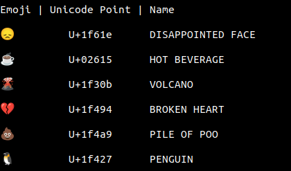

This is a simple program for displaying the emoji, their Unicode code point and their name using the '**unicodedata**' library.

Output of the program:

Link to [Python unicodedata](https://docs.python.org/3/library/unicodedata.html)
